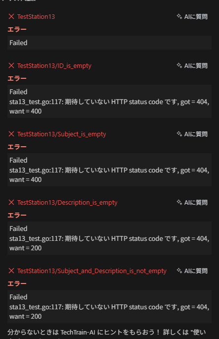

以下の手順でコンフリクトを解消した。

# 1. フォーク元をリモートとして追加（まだの場合）

git remote add upstream https://github.com/TechBowl-japan/go-stations.git

# 2. フォーク元の最新情報を取得

git fetch upstream

# 3. フォーク元のmainブランチを自分のブランチにマージ

git merge upstream/main

なぜかTechTrainの拡張機能が実行できないので，temp-mainを作成し，mainは完全にFork元と同期した。

mainで拡張機能を実行するとこのエラーがでる



# AIの回答

HandleFunc と Handle の違いが問題です。

HandleFuncが問題な理由：

HandleFunc(pattern, handlerFunc) は http.HandlerFunc 型（func(http.ResponseWriter, \*http.Request)）を期待します
handler.NewHealthzHandler().ServeHTTP はメソッド値で、これを直接 HandleFunc に渡すことはできません
一方、Handle を使う理由：

Handle(pattern, handler) は http.Handler インターフェース（ServeHTTP(http.ResponseWriter, \*http.Request) メソッドを持つ型）を期待します
HealthzHandler は ServeHTTP メソッドを実装しているため、http.Handler インターフェースを満たしており、Handle に直接渡せます
つまり：

これが修正した理由です。

# 環境変数回り

goimportsが使えないので，パスを通した。
以下を `~/.bashrc` に追記

```bash
export PATH="$PATH:$HOME/go/bin"
```

以下を実行。
（現在のシェルで .bashrc を再読み込みさせる）

```bash
source ~/.bashrc
```

.bashrc はシェル起動時に毎回読み込まれるらしい。なので， .bashrc に追記する形でPATHを上書きする。
PATH自体を恒久的に上書きするのはできないっぽい。なので, .bashrc？

ようわからんが，wsl --shutdownしないと他のシェルには反映されなかった。

# フォーマッターまわり

とりあえず以下実行すればおけ

```bash
goimports -w .
```

